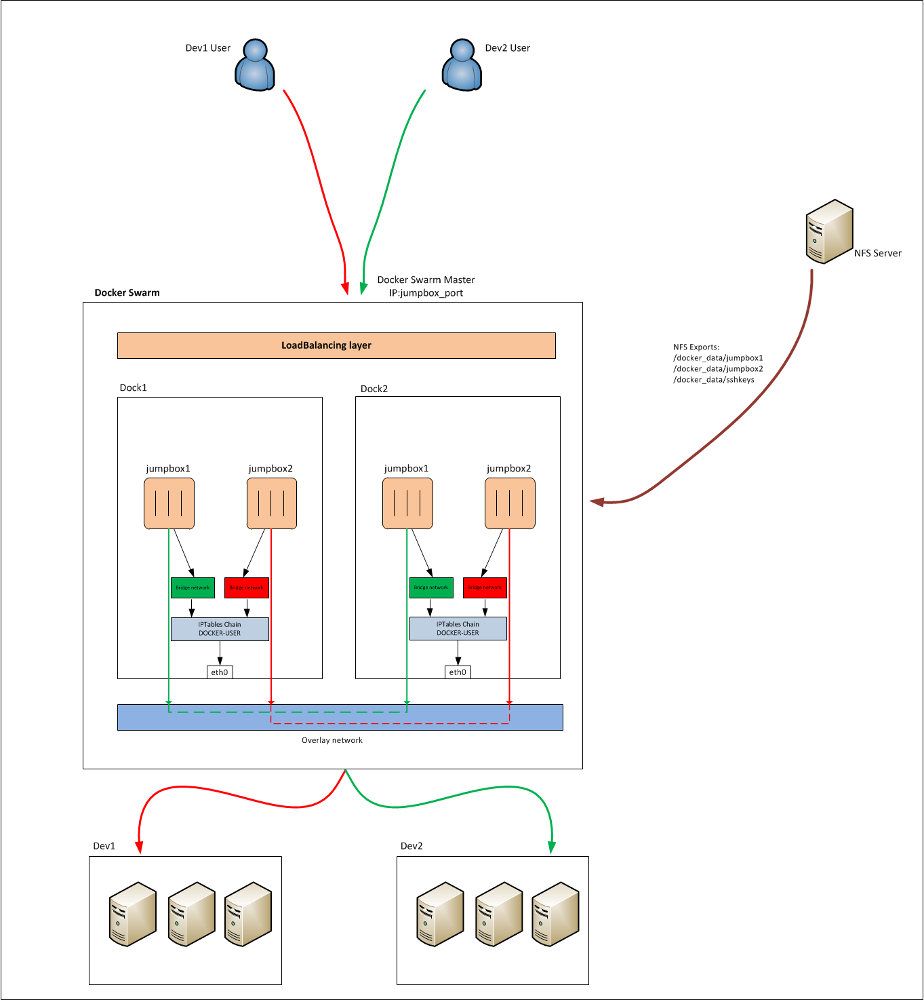

## Starting ssh-jumpbox stack on Docker Swarm
For redundancy/loadbalancing purpose ssh-jumpbox can be deployed as Docker Stack on Swarm. For full redundancy I use NFS share (AWS EFS) where volumes and ssh public keys will be kept to allow users to access their local files across all containers in stack.

### Prepare NFS shares
I will not describe how to create NFS server as there is plenty of information on internet about "How To Do It".

"exports" file:
```
/docker_data/jumpbox1 Docker_Swarm_IP/24(rw,sync,no_root_squash,no_all_squash)
/docker_data/jumpbox2 Docker_Swarm_IP/24(rw,sync,no_root_squash,no_all_squash)
/docker_data/sshkeys Docker_Swarm_IP/24(rw,sync,no_root_squash,no_all_squash)
```
Directory "/docker_data/sshkeys" contains files with sshkeys:
```
jumpbox1
jumpbox2
jumpboxX
```

### Mount NFS on each of Swarm nodes

Create mount point:
```
$ sudo mkdir -p /opt/sshkeys
$ sudo chmod 777 /opt/sshkeys
```
Mount NFS:
```
$ sudo mount -t nfs NFS_SERVER_IP:/docker_data/sshkeys/ /opt/sshkeys/
```
Use /etc/fstab or Autofs to mount NFS share permanently during system startup.

### Create stack file
Open file  'ssh-jumpbox1_compose.yml' in your favourite editor and place below lines into it
```
version: "3.2"

services:
  ssh-jumpbox1:
    image: monsoft/ssh-jumpbox
    hostname: jumpbox1
    environment:
      USERS: 'test1 test2'
    ports:
      - "1022:22"
    networks:
      - jumpbox1
    volumes:
      - ssh-jumpbox1:/home
      - /opt/sshkeys/jumpbox1:/etc/authorized-keys
    deploy:
      mode: replicated
      replicas: 2

volumes:
  ssh-jumpbox1:
    driver: local
    driver_opts:
      type: nfs
      o: "addr=192.168.56.130,nolock,soft,rw"
      device: ":/docker_data/jumpbox1"

networks:
  jumpbox1:
    driver: overlay
    attachable: true
    ipam:
      config:
        - subnet: 172.28.1.0/29
```

### Deploying ssh-jumpbox stack
To deploye ssh-jumpbox stack run below command
```
$ docker stack deploy -c ssh-jumpbox1_compose.yml ssh-jumpbox1
```
or if you build your own image and pushed it to private Docker Hub repository
```
$ docker stack deploy -c ssh-jumpbox1_compose.yml ssh-jumpbox1 --with-registry-auth
```
## Network separation
I guess that there is many ways to do it, and mine don't have to be the best one.



Containers traffic passing via IPtables chain 'DOCKER-USER' and as it is recommended we will modify this chain to grand/deny traffic

To allow user Dev1 access only Dev1 servers (IP subnet 192.168.1.0/24) we need to add IPtables rule on each docker's node:
```
iptables -I DOCKER-USER -i docker_gwbridge ! -o docker_gwbridge -s container_bridged_IP -j REJECT --reject-with icmp-port-unreachable
iptables -I DOCKER-USER -d 192.168.1.0/24 -i docker_gwbridge ! -o docker_gwbridge -s container_bridged_IP -j ACCEPT
 ```

Script 'allow_access.sh' will take care of finding container's IP address and modify iptables:
```
# ./allow_access.sh caa5409a318f "192.168.1.0/24"
Container's IP in gwbridge network: 172.18.0.3

# iptables -L DOCKER-USER
Chain DOCKER-USER (1 references)
target     prot opt source               destination         
ACCEPT     all  --  172.18.0.3           192.168.1.0/24             
REJECT     all  --  172.18.0.3           anywhere             reject-with icmp-port-unreachable
RETURN     all  --  anywhere             anywhere        
```

All these setups can be (should be) automated by one of orchestrations tools like Ansible, Chef or Puppet.
